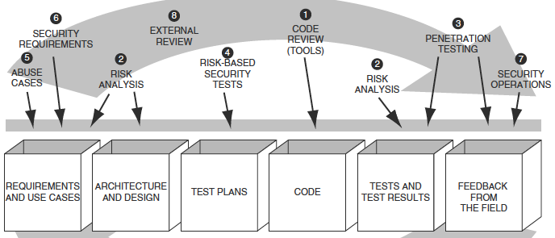

# Secure Programming with Static Analysis
---

## Introduction
---
**Software Security Touchpoints**  
All software projects produce at least one artifact, CODE, making Code Review the most important touchpoint in software security. At the code level, focus is on _Implementation Bugs_.  

## PART 1: Software Security and Static Analysis
---

## PART 2: Pervasive Problems
---

## PART 3: Features and Flavours
---

## PART 4: Static Analysis in Practice
---
